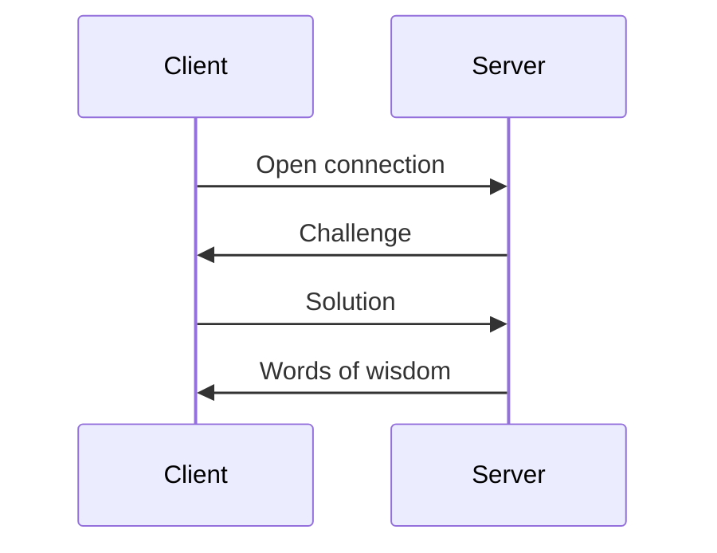

# powwow

“Word of Wisdom” tcp server with a Proof of Work DDOS protection.

## Prerequisites

Docker - https://docs.docker.com/engine/install

## Algorithm Selection

I choose hashcash because:

- Simple algorithm
- Dynamic difficulty
- Inexpensive to validate on server side
- Used in bitcoin and other cryptocurrencies and have more documentation because of that

## Architecture

Client and server communicate over TCP. One TCP session is intended for a single wisdom exchange.

Protobuf is used for message marshaling to avoid reinventing the wheel.

- [cmd](./cmd) - executables
- [hashcash](./hashcash) - hashcash implementation
- [proto](./proto) - protobuf definitions
- [tcp](./tcp) - tcp server implementation
- [wisdom](./wisdom) - wisdom quotes generator

## Testing and Development

To run all tests run `make test`.

To run the project locally execute  `make build`, then `make start-server`.
After that each `make start-client` will output one wisdom.

To generate messages from Protobuf definitions run `make gen`.